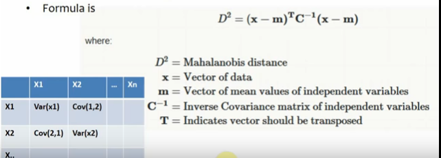
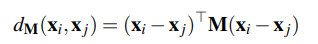

# Note

## Mahalanobis Distance
[Intuitive Explanation](https://www.youtube.com/watch?v=3IdvoI8O9hU)
* Transforms Variables into uncorrelated variables
    1. Gets rid of the variance and covariance of the data
* Makes variances equal to 1
    1. Standardized the data (normalized?)
* Attempts to calculate simple euclidean distance

* By inversing the covariance matrix, it is similar to multi-variate standardization( Dividing by covariance )

## mAP mean Average Precision

[Calculating mAP]( https://medium.com/@jonathan_hui/map-mean-average-precision-for-object-detection-45c121a31173 )

* Precision: Measures how accurate is your predictions. i.e, the percentage of your positive predictions are correct
    1. For the case of a gallery, the K nearest neighbors are our prediction.
    2. So the precision is the % of those K neighbors that are true ( True Positive / K Neighbors )
* Recall: How good you find all the positives. For example, we find 80% of the positive cases in the top K predictions.

### What is mAP

* Just the average of the APs for all queries.
* 1400 queries, we sum the APs for each query and divide by 1400

## Mahalanobis Distance Learning for Person Re-Identification

### Metric Learning

* Run PCA to reduce dimensionality and noise removal
* During training, learn a Mahalanobis metric __M__

* Distance between two samples x_i and x_j is evaluated using equation:

    

### Classification

* In re-identification, we want to recognize a certain person across different non-overlapping camera views.
* Probe Image: Person image selected in one view
* Gallery Image: We want to detect the person in the probe image in the selection of images in the gallery.
* This is achieved by calculating distances between the probe image and all gallery images using a learned metric, and returning those gallery images with the smallest distances as potential matches.
